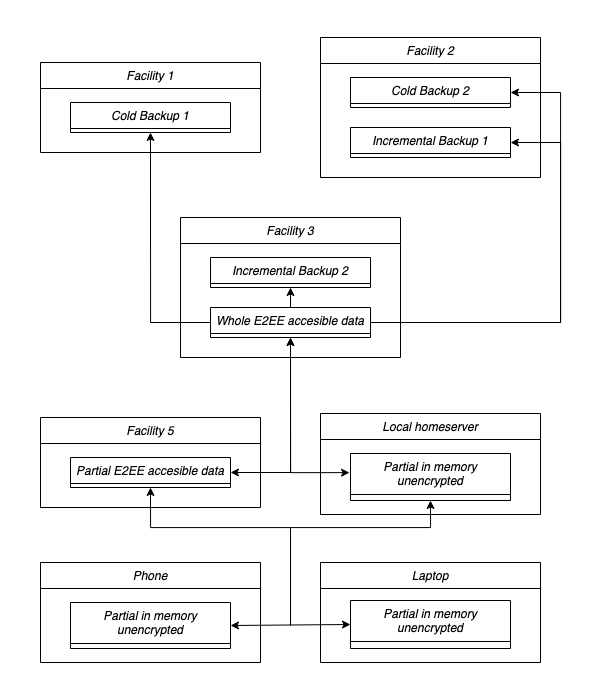

*_This is first post on a series about the next gen OS I would like for myself_*

----

One of our building blocks for the next gen OS is the __separation between
data and interface__. The data should be owned and controlled by the user
while other users/apps can access and process the data in a granular way
respecting the user choices. Let's analyse diferent types of data and their
characteristics.

We part from this three premises:

1. Not all data is equal
1. Not all devices are equally trustworthy
1. Data is personal/private

Not all data is equal
---------------------

On one hand we may have extremely sensitive data that we want to safeguard as
best as possible even if it comes at the expense of degraded experience such
as slow/expensive access or lack of functionality (search). We are willing to
pay a premium for extra security and reliability.

We also have data that we use often for which we want fast and cheap lookups
and processing. We may want just the latests data or the whole data accesible
this way. At increasing risk of leaking some of it.

Not all stores/devices are equal
--------------------------------

How can we define where the data lives? It might just be a plain and simple
storage but we quickly find use cases where we need a whole gamut of processing
done with the data. Do you need to read/access all the data as one big BLOB
block?  Do you want to append data incrementally? Do you want to perform a
remote search/analysis in the data and only fetch the results?

I'm referring to this category as __stores__ or __devices__ while I'm still
looking for a better name.

Stores/devices can be classified by:

* Cost: how much does it cost to store data? How much does it cost to
  read/write or process the data?
* Speed: how fast is it to write or retrieve some data? How fast can we
  perform transformations to the data?
* Trustworthiness: do we trust this device with my unencrypted data? How much
  metadata am I willing to leak?

Data is personal/private
------------------------

Data is private means that we need to choose who or which app we allow access
to each piece of our data. By default only the user can access the data in a
secure way.

Data is personal means no two users are the same and that no one but the user
should be able to decide how to store and process their data. For a certain
user all data should be secured as best as possible while another user might
want the best experience possible risking leaking some metadata. Each users
can mix and match parts of their data in their own way maintaining complete
control.

How to store the data?
----------------------

Splitting the data from apps/interfaces means that we won't save any data in
services not owned by us thus remaining in our own and sole ownership.

Not all data has the same form. And we may want to store the same data in
different forms in different devices. In each device all the data will be
stored in the same datastore as a mix of:

* SQL
* BLOBs
* Document store

Part of the data can be encrypted while part of it can be accessible by the
device for processing in different levels (see bellow).

Let's now analyse different types of storage/devices and different usages in
increasing metadata leakage and risks.

Cold/hard backups
-----------------

This is perhaps the easiest type of storage. A hard, secure and cheap copy of
the user's whole data completely encrypted that we would save sparingly and
almost never request. Only in case of loss of data in the other stores/devices.

To access a part of the data we would need to request the whole data which
would be expensive and slow.

Storage should be cheap and reading the data might be slow. It can be saved in
any store included untrusted ones.

It can be stored in write-only mediums that can't be erased, only destroyed.

Metadata leakage: overall size of data.

Risks: only when exposing the encryption keys.

Incremental backups
-------------------

Incremental backups need more often writes than the cold backups and the
possibility to append data. The whole backup can be reconstructed by going over
the original backup and each appended piece. We would save each write as an
encrypted BLOB block.

For the appended data we would need to maintain a "last updated" property for
every piece of data to only save the changes. We woluld also need to mark or
list hashes as deleted instead of completely removing them.

We would maintain only one backup like this (but maybe multiple copies in
different stores) while recreating it when needed.

It doesn't need to be so cheap and we need to delete it when recreating it.

We can also store this type of data in untrusted stores.

Metadata leakage: size of append + growth rate

E2EE accessible data
--------------------

We need to have the data stored securely but accessible in a granular way. In
this store all the data is encrypted but in small chunks accessible by hashes.
It isn't just one big encrypted BLOB block.

The device needs to perform a lookup once a hash (or list of hashes) is
requested. It also needs to be able to modify hashes content. This is a "usage"
store that needs to be updated once a change in the data is made.

Metadata leakage : access patterns / amount of hashes

Risks: someone with access to the store logs/traffic and your current usage
(i.e. seeing the action you are performing in your phone) might be able to
link a certain hash to a piece of real data, but without access to the
content.

E2EE accessible data + Searchable Encryption + Indexes
------------------------------------------------------

This is an enhancement of the previous store/device but with added Searchable
Encryption and indexes (and maybe other secure capabilities) so we can perform
some common processing in large amounts of data (like searching email).

Each user can decide on what type of data they want indexes/keywords, it
doesn't necessary means all of the data should be indexed.

Metadata leakage: hashed keywords/indexes and their size + patterns of usage

Risks: we can leak more usage patterns but at the same time we gain lots of
functionality.

In memory unencrypted data
--------------------------

Only for trusted devices: a local homeserver, your laptop or your handheld
computer. Here you can process all the data in any way you need.

Due to hardware limitations you don't need to have all the data all the time
in these devices but subset of it while you can request missing data on demand.
You can have certain types of data or just the recent data for a particular
category.

Risks: if the device is pwned all the available data might be stolen. You can
mitigate this by only having the data you are currently using.

Mix and matching
----------------

A user might want to split their data in any number of backups, E2EE accessible
data, or in memory unencrypted data. Each of them can have all the data or a
partition of it.

For example an user might want to have cold backups in three different
facilities while having incremental backups in two facilities, their whole data
in an E2EE accesible data device and their most common used data and last used
data replicated in two datacenters. While only a small subset of their data in
an in-memory unencrypted fashion in a local homeserver and even a smaller
subset in their phone and laptop.

Role based access control & auditing
------------------------------------

Some kind of RBAC needs to be implemented to allow apps/interfaces access to
only part of your data.

Also some kind access log/auditing needs to be present storing how the data is
used and manipulated in order to capture misbehaving actors.

Private processing of data by a third party
-------------------------------------------

We may want to run a closed/propietary algorithm on a piece of data without
giving the data to the service while at the same time keeping the processing
algorithm private from us. How can we do this?

By hashing the data we want to process, giving the hash to the service that
must validate it and running the algorithm with our unencrypted data in a
mutually trusted "runner".

If homomorphic encryption matures enough it can be used instead for a
completely secure and private computation without relying on a third party.

Shared data
-----------

Interfaces can only get data from local storage. If an app needs to access
shared data it must first copy it to local storage where the interface can
retrieve it. This way each user can decide if they want to persist that data.

This goes in complete contraposition to DRM idea.

Identity and authorisation
--------------------------

No more passwords should be required for identification once identified. It
needs to be centralised but we do need different levels of authorisation. 

Accessing some data in a device can be open to only requiring identity while
some other data might need a simple auth (password/2fa/token) or high security
auth like biometrics.

Each user can choose their own different levels of authorisation and which is
needed for each piece of data. The encryption should be done taking this
levels into consideration.

Conclusions
-----------

Let's analyse what this all means. Here's a comparative table of all the
devices/storages:

|storage|trustworthiness|metadata leakage|cost|UX|risk|
|-|-|-|-|-|-|
|cold backup|untrusted|overall backup size|- -|- -|low|
|incremental backup|untrusted|growth rate|-|-|low|
|E2EE accessible|untrusted|access patterns|+|+|medium|
|in memory unencrypted|trusted||+ +|++|high|

As we can see from this comparison better user experience comes at the cost of
high prices and high risk. I'm personally willing to pay a cost in UX and price
for more secure and private data. But not everyone might be inclined that way.

Much work should be put in explaining these concepts and pros/cons to the users
and provide an easy UI/UX to manage all this power. Maybe a general quick
slider between ease of use and sercurity/privacy that the general public can
use with more granular settings for sensitive data. This should be easy to
understand and use.

Another open question is how to partition the data into something manageable.
How do we group similar data? Does each app create their own categories?

What would an MVP look like? What technologies should be used in the
implementation?

The point about shared data is a crucial one. Separation of data and interfaces
is what allows this to be possible and might be the biggest change from the
current computing status quo. I'll be writing more about this soon.

----

For comments and discussion please visit [talks](https://talks.regeneratio.org/t/not-all-data-is-equal-discussion/102).

If you aren't a member of regeneratio you can reach me at `ras at
regeneratio.org`.
